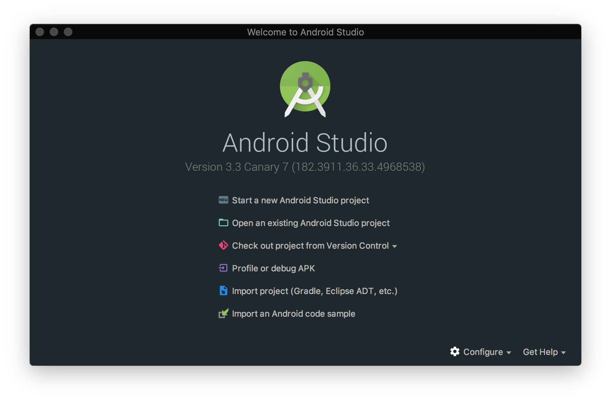
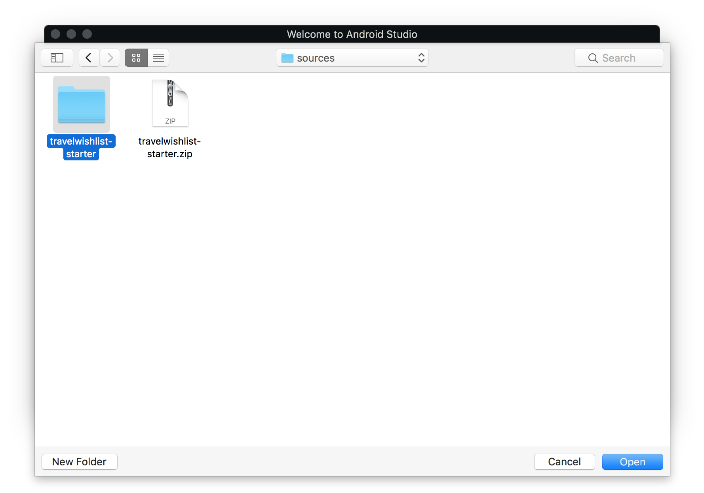
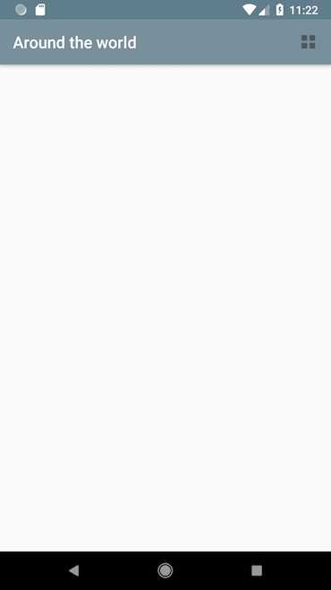
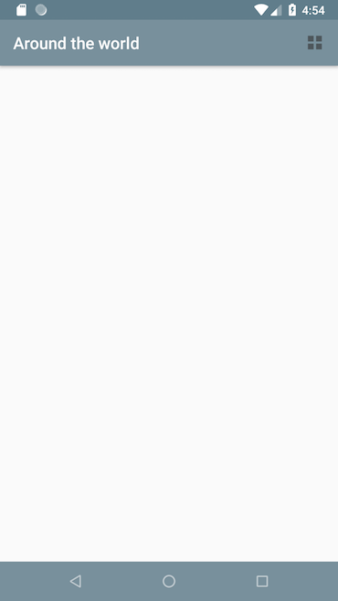

# Android - An Introduction to Material Design with Kotlin

> Version

```Android Studio 3.3 Canary7``` ```gradle-4.9-all.zip``` ```gradle:3.3.0-alpha07``` ```compileSdkVersion 27``` ```buildToolsVersion "28.0.2"``` ```minSdkVersion 21``` ```targetSdkVersion 27``` ```Kotlin 1.2.60``` ```SupportVersion 27.1.1```

- 기존 앱에 머티리얼 디자인을 적용하는 방법과 새로운 애니메이션 API를 사용하여 멋진 인터랙션을 만드는 방법을 배움

- 머티리얼 디자인은 촉각 표면, 대담한 그래픽 디자인 및 유동적인 모션을 결합한 아름답고 직관적인 경험을 만드는 인터페이스이고 안드로이드 앱을 위한 사용자 경험 철학임

- Travel Wishlist라는 앱에 머티리얼 디자인을 적용하면서 배우게 될 내용

  - 머티리얼 테마 구현
  
  - RecyclerView, CardView에서 동적으로 뷰 생성 방법

  - 텍스트나 배경에 사용할 팔레트 API를 사용하여 색 스킴 생성

  - 안드로이드 애니메이션 API를 사용해서 멋진 인터랙션 만드는 법

## 시작하기

- <U>[프로젝트](sources/travelwishlist-starter.zip)</U> 다운로드 후 **Android Studio** 시작

- **Android Studio** 시작 창에서 **Open an existing Android Studio project** 선택



- 그런 다음 다운로드 한 프로젝트를 선택하고 **Open** 클릭



- Travel Wishlist 앱은 세계 여러지역에 있는 이미지들을 선택하여 노트에 추가하는 앱임

- 다운로드 받은 프로젝트를 빌드하고 실행하면 아래와 같이 기본적인 인터페이스가 화면에 표시됨

  <br><br>

- 현재는 아무것도 없이 비어있지만 머티리얼 컴포넌트인 동적 뷰, 색 스킴, 애니메이션을 활용해 멋진 사진 세트를 추가할 것임

- 앱 수준의 **build.gradle** 파일을 열어서 RecyclerView, CardView, Palette, Picasso 의존성을 추가함

```gradle
dependencies {
    implementation fileTree(dir: 'libs', include: ['*.jar'])
    implementation 'com.android.support:appcompat-v7:27.1.1'
    implementation 'com.android.support:recyclerview-v7:27.1.1'
    implementation 'com.android.support:cardview-v7:27.1.1'
    implementation 'com.android.support:palette-v7:27.1.1'
    implementation 'com.squareup.picasso:picasso:2.5.2'
    testImplementation 'junit:junit:4.12'
    androidTestImplementation 'com.android.support.test:runner:1.0.0'
    androidTestImplementation 'com.android.support.test.espresso:espresso-core:3.0.0'
}
```

- 위와 같이 선언함으로 의존성을 간단히 추가함. 대부분은 구글에서 제공하는 것이지만 Square에서 제공하는 이미지 다운로드 및 캐싱 라이브러리인 Picasso도 사용함

- 의존성을 추가했으면 앱에 머티리얼 디자인을 적용할 시간

## 테마 설정하기

- **res/values/style.xml** 파일을 열어서 기본으로 설정되어 있는 ```Theme.AppCompat.Light.DarkActionBar``` 테마에 아래 항목을 추가함

```xml
<item name="android:navigationBarColor">@color/primary_dark</item>
<item name="android:displayOptions">disableHome</item>
```

- 안드로이드는 colorPrimary는 액션바에 colorPrimaryDark는 상태바에 colorAccent는 텍스트 입력, 체크박스 같은 위젯에 자동으로 적용됨. 위 옵션은 하단 네비게이션바에 색상 및 설정을 추가함

- 빌드 후 실행하면 네비게이션바에 새로운 색 스킴이 적용됨

  <br><br>

- 미묘한 변화지만 이처럼 Travel Wishlist가 한 단계씩 업그레이드 될것임

## RecyclerView, CardView 사용하기

- 제한된 화면에 많은 양의 데이터를 보여주기 위해 ListView보다 다재다능한 RecyclerView를 사용하여 같은 데이터지만 다양한 Grid 형태로 보여줄 것임

- **activity_main.xml**을 열고 LinearLayout안에 다음을 추가함

```xml
<android.support.v7.widget.RecyclerView
  android:id="@+id/list"
  android:layout_width="match_parent"
  android:layout_height="match_parent"
  android:background="@color/light_gray" />
```

- 액티비티에 추가한 RecyclerView는 부모 영역 전체를 차지하게 함


## 리스트에서 팔레트 API 사용하기

## 새로운 머티리얼 API 사용하기

## 그 다음은?