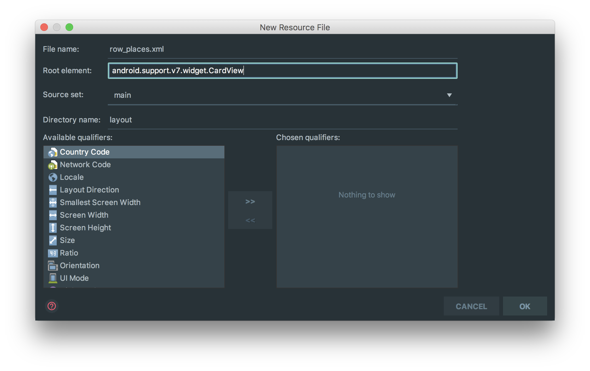

# 안드로이드 머티리얼 디자인 소개 (Android - An Introduction to Material Design with Kotlin)

> 프로젝트 관련하여 사용한 툴 및 라이브러리 버전```Version```은 다음과 같다.

```Android Studio 3.3 Canary7``` ```gradle-4.9-all.zip``` ```gradle:3.3.0-alpha07``` ```compileSdkVersion 27``` ```buildToolsVersion "28.0.2"``` ```minSdkVersion 21``` ```targetSdkVersion 27``` ```Kotlin 1.2.60``` ```SupportVersion 27.1.1```

기존 앱에 머티리얼 디자인을 적용하는 방법과 새로운 애니메이션 API를 사용하여 멋진 인터랙션을 만드는 방법을 배우게 된다. 머티리얼 디자인은 촉각 표면, 대담한 그래픽 디자인 및 유동적인 모션을 결합한 아름답고 직관적인 경험을 만드는 인터페이스이고 안드로이드 앱을 위한 사용자 경험 철학이다. Travel Wishlist라는 앱에 머티리얼 디자인을 적용하면서 배우게 될 내용은 다음과 같다.

  - 머티리얼 테마 구현
  - ```RecyclerView```, ```CardView```에서 동적으로 뷰 생성 방법
  - 텍스트나 배경에 사용할 팔레트 API를 사용하여 색 스킴 생성
  - 안드로이드 애니메이션 API를 사용해서 멋진 인터랙션 만드는 법

## 시작하기

<U>[프로젝트](sources/travelwishlist-starter.zip)</U>를 다운로드 하고 압축을 푼다음 ```Android Studio```를 시작한다. 다음과 같은 창이 보이면 ```Open an existing Android Studio project```를 선택한다.


그런 다음 프로젝트를 선택하고 열기```Open```을 누른다.


Travel Wishlist 앱은 세계 여러지역에 있는 이미지들을 선택하여 노트에 추가하는 앱이다. 다운로드 받은 프로젝트를 빌드하고 실행하면 아래와 같이 기본적인 인터페이스가 화면에 표시됨을 확인한다.

<br><center></center><br>

현재는 아무것도 없이 비어있지만 머티리얼 컴포넌트인 동적 뷰, 색 스킴, 애니메이션을 활용해 멋진 사진 세트를 추가할 것이다. 우선 앱 수준의 ```build.gradle``` 파일을 열어서 ```RecyclerView```, ```CardView```, ```Palette```, ```Picasso``` 의존성을 추가한다.

```gradle
dependencies {
    implementation fileTree(dir: 'libs', include: ['*.jar'])
    implementation 'com.android.support:appcompat-v7:27.1.1'
    implementation 'com.android.support:recyclerview-v7:27.1.1'
    implementation 'com.android.support:cardview-v7:27.1.1'
    implementation 'com.android.support:palette-v7:27.1.1'
    implementation 'com.squareup.picasso:picasso:2.5.2'
    testImplementation 'junit:junit:4.12'
    androidTestImplementation 'com.android.support.test:runner:1.0.0'
    androidTestImplementation 'com.android.support.test.espresso:espresso-core:3.0.0'
}
```

위와 같이 선언함으로 의존성을 간단히 추가할 수 있다. 대부분은 구글에서 제공하는 것이지만 Square에서 제공하는 이미지 다운로드 및 캐싱 라이브러리인 Picasso도 사용한다. 의존성을 추가했으면 이제 앱에 머티리얼 디자인을 적용할 시간이다.

## 테마 설정하기

```res/values/style.xml``` 파일을 열어서 기본으로 설정되어 있는 ```Theme.AppCompat.Light.DarkActionBar``` 테마에 아래 항목을 추가한다.

```xml
<item name="android:navigationBarColor">@color/primary_dark</item>
<item name="android:displayOptions">disableHome</item>
```

안드로이드는 기본적으로 ```colorPrimary```는 액션바에 ```colorPrimaryDark```는 상태바에 ```colorAccent```는 텍스트 입력, 체크박스 같은 위젯에 자동으로 적용된다. 위 옵션은 하단 네비게이션바에 색상 및 ```android:displayOptions```에 ```disableHome``` 설정을 추가하는 것이다. 빌드 후 실행하면 네비게이션바에 새로운 색 스킴이 적용된다.

  <br><center></center><br>

미묘한 변화지만 이처럼 Travel Wishlist가 한 단계씩 업그레이드 될 것이다.

## RecyclerView, CardView 사용하기

제한된 화면에 많은 양의 데이터를 보여주기 위해 리스트뷰```ListView```보다 다재다능한 ```RecyclerView```를 사용하여 같은 데이터지를 다양한 형태의 그리드```Grid```로 표현할 것이다. ```activity_main.xml```을 열고 리니어 레이아웃```LinearLayout```안에 다음을 추가한다.

```xml
<android.support.v7.widget.RecyclerView
  android:id="@+id/list"
  android:layout_width="match_parent"
  android:layout_height="match_parent"
  android:background="@color/light_gray" />
```

액티비티에 추가한 ```RecyclerView```를 부모 영역 전체를 차지하게 설정한다. 귀찮은 작업을 자동으로 하기 위해 자동 임포트```Import```문 설정을 활성화 하자. ```Preferences\Editor\General\Auto Import```로 이동해서 ```Add unambiguous imports on the fly``` 체크박스를 체크한다. 임포트를 수동으로 넣어주거나 Alt+Enter하는 수고를 덜어준다.

```kotlin
lateinit private var staggeredLayoutManager: StaggeredGridLayoutManager
```

```LayoutManager```를 추가하고 ```onCreate()``` 함수에 초기화 코드를 작성한다.

```kotlin
staggeredLayoutManager = StaggeredGridLayoutManager(1, StaggeredGridLayoutManager.VERTICAL)
list.layoutManager = staggeredLayoutManager
```

```RecyclerView```에 ```StaggeredGridLayoutManager```를 레이아웃 매니저로 설정하고 1, ```StaggeredGridLayoutManager.VERTICAL```로 값을 적용한다. 1 설정값은 그리드 형태가 아닌 리스트```List``` 형태로 보이게 해준다. 우선 이렇게 세팅하고 나중에는 두개의 컬럼 형태로 보이게 설정할 것이다.

```Kotlin Android Extensions```를 사용하고 있다면 ```list```를 사용하기 위해 ```findViewById()```를 할 필요가 없다. 그냥 ```list```를 사용하면 아래 임포트문이 자동으로 추가된다.

```kotlin
import kotlinx.android.synthetic.main.activity_main.*
```

둥근 모서리, 그림자를 포함한 ```CardView```는 일관된 형태로 행/셀을 구현할 수 있고, 기본적으로 ```FrameLayout```을 상속받기에 기본적으로 다른 자식뷰를 가질 수 있다. ```res\layout``` 디렉토리로 이동하여 ```Layout resource file``` 메뉴를 통해 새로운 리소스 파일을 만들자. 이름은 ```row_places.xml``, 부모는 ``android.support.v7.widget.CardView```로 한다.



원하는 셀을 만들기 위해 아래 코드로 내용을 교체한다.

```xml
<?xml version="1.0" encoding="utf-8"?>

<android.support.v7.widget.CardView xmlns:android="http://schemas.android.com/apk/res/android"
  xmlns:card_view="http://schemas.android.com/apk/res-auto"
  android:id="@+id/placeCard"
  android:layout_width="match_parent"
  android:layout_height="wrap_content"
  android:layout_margin="8dp"
  card_view:cardCornerRadius="@dimen/card_corner_radius"
  card_view:cardElevation="@dimen/card_elevation">

  <ImageView
    android:id="@+id/placeImage"
    android:layout_width="match_parent"
    android:layout_height="200dp"
    android:scaleType="centerCrop" />

  <LinearLayout
    android:id="@+id/placeHolder"
    android:layout_width="match_parent"
    android:layout_height="match_parent"
    android:background="?android:selectableItemBackground"
    android:orientation="horizontal" />

  <LinearLayout
    android:id="@+id/placeNameHolder"
    android:layout_width="match_parent"
    android:layout_height="45dp"
    android:layout_gravity="bottom"
    android:orientation="horizontal">

    <TextView
      android:id="@+id/placeName"
      android:layout_width="match_parent"
      android:layout_height="wrap_content"
      android:layout_gravity="center_vertical"
      android:gravity="start"
      android:paddingStart="10dp"
      android:paddingEnd="10dp"
      android:textAppearance="?android:attr/textAppearanceLarge"
      android:textColor="@android:color/white" />

  </LinearLayout>

</android.support.v7.widget.CardView>
```

```xmlns:card_view="http://schemas.android.com/apk/res-auto```를 넣음으로써  ```card_view:cardCornerRadius```와 ```card_view:cardElevation```같은 속성을 정의할 수 있고 ```?android:selectableItemBackground```를 배경으로 넣으면 ```ripple``` 이펙트 애니메이션이 활성화 된다.

기본적으로 ```RecyclerView```에 데이터를 바인딩 하기 위해 어답터```Adapter```를 사용한다. ```main/java``` 폴더로 이동 후 ```com.raywenderlich.android.travelwishlist``` 패키지에서 오른쪽 마우스 버튼 클릭하고 ```New\Kotlin File/Class```를 선택한 다음 종류를 클래스로 변경 후 이름을 ```TravelListAdapter```로 입력하여 어답터를 생성한다. 그리고 ```TravelListAdapter```에 아래의 내용을 추가한다.

```kotlin
// 1
class TravelListAdapter(private var context: Context) : RecyclerView.Adapter<TravelListAdapter.ViewHolder>() {

  override fun getItemCount(): Int {

  }

  override fun onCreateViewHolder(parent: ViewGroup?, viewType: Int): ViewHolder {

  }

  override fun onBindViewHolder(holder: ViewHolder?, position: Int) {

  }

  // 2
  inner class ViewHolder(itemView: View) : RecyclerView.ViewHolder(itemView) {

  }
}
```

  - ```RecyclerView.Adapter```를 상속받아 ```TravelListAdapter```를 만들고 구현해야 할 항목들을 오버라이드 함. 생성자에 ```Context```를 받도록 변경하고 ```MainActivity``` 인스턴스를 넘겨받음
  - 각 셀별로 ```findViewById()```를 하지않아 스크롤 성능을 향상시키는 ```ViewHolder``` 패턴을 적용하기 위해 ```ViewHodler``` 내부 클래스```inner class```를 만듬. ```ViewHolder```는 ```ListView```에서는 옵션이었지만 ```RecyclerView```에서는 강제임
  - ```TravelListAdapter``` 클래스의 ```RecyclerView.Adapter``` 오버라이드 함수들을 아래와 같이 수정함

```kotlin
// 1
override fun getItemCount() = PlaceData.placeList().size

// 2
override fun onCreateViewHolder(parent: ViewGroup, viewType: Int): ViewHolder {
  val itemView = LayoutInflator.from(parent.context).inflate(R.layout.row_places, parent, false)
  return ViewHolder(itemView)
}

// 3
override fun onBindViewHolder(holder: ViewHolder, position: Int) {
  val place = PlaceData.placeList()[position]
  holder.itemView.placeName.text = place.name

  Picasso.with(context).load(place.getImageResourceId(context)).into(holder.itemView.placeImage)
}
```

  - ```getItemCount()```는 아이템 개수를 넘겨주는 역할로 여기서는 ```PlaceData.placeList()```의 개수를 사용함
  - ```onCreateViewHolder(...)```는 ```row_places```를 통해 생성한 한 뷰를 매개변수로 넘겨받아 ViewHolder 인스턴스를 생성하여 넘겨줌
  - ```onBindViewHolder(...)```는 ```Place``` 객체를 ```ViewHolder```안에 있는 UI 요소에 바인드 시킴. Picasso는 이미지 캐시를 위해 사용함

```MainActivity```에 새로 만든 ```TravelListAdapter``` 변수를 추가한다.

```kotlin
lateinit private var adapter: TravelListAdapter
```

```onCreate()``` 함수에서 맨 아래에 어답터 인스턴스를 만든다음 ```RecyclerView```에 전달한다.

```kotlin
adapter = TravelListAdapter(this)
list.adapter = adapter
```

빌드 후 실행하면 places 목록으로 채워진 화면을 볼 수 있다.

  <br><center></center><br>

## 리스트에서 팔레트 API 사용하기

## 새로운 머티리얼 API 사용하기

## 그 다음은?